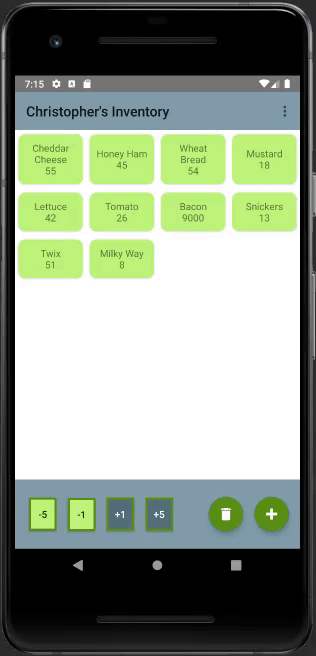
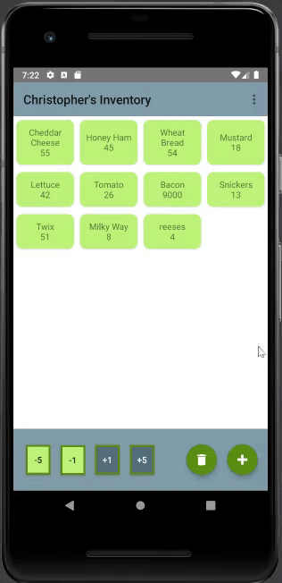
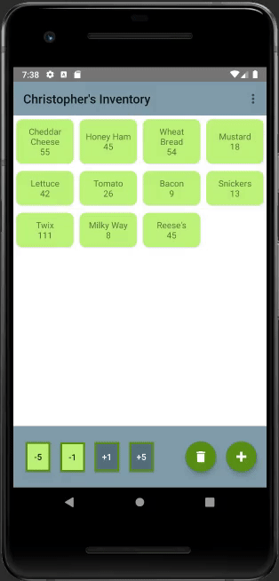
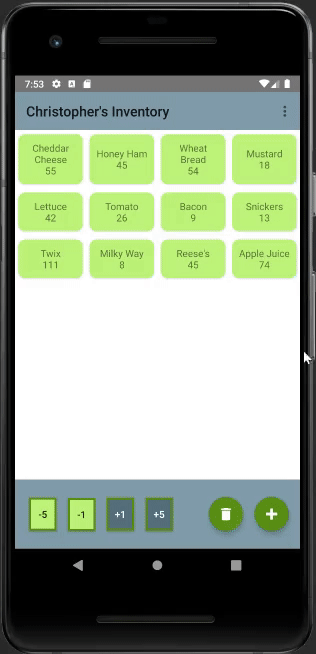
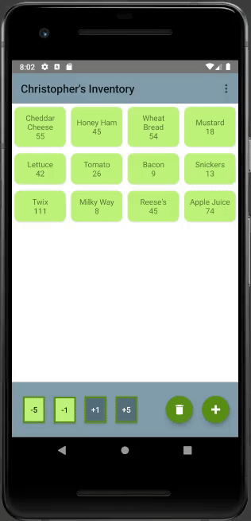

# Welcome to Christopher Melugin's GitHub Page and ePortfolio

### Assessment of Values
Throughout the pursuance of my Computer Science degree in an online-only learning environment, I have honed my **_self-motivation and attention to detail_**, which is evidenced by my **_3.98 GPA_**. Throughout this time and the past 7.5 years, I have been working full time to support my family which has required a great deal of **_dedication_** and no small amount of sacrifice to achieve my educational goals. My combined experiences have taught me that **_professionalism, communication, respect, honesty, and quality_** are among the greatest assets a company can have in an employee, and I strongly believe I have cultivated these qualities to great effect. 

### Assessment of Skills and Knowledge
Within Computer Science and the development of this portfolio, I have demonstrated mastery over the fundamentals of each of the following:

- **data structures and algorithms** to handle computations in an efficient, stable, and safe manner

- **software engineering** including good design decisions with the long term kept foremost in mind

- **software architecture** to ensure smooth intuitive development

- **database operations** that are clean and effective

- **version control** to keep projects organized and maintain efficient team collaboration.

- **general security** to keep people and data safe and prevent undefined behavior.

#### RESUME
A more complete form of my employable skills and experience are contained in my resume which you can find [here](Resume 2021/Christopher Kent Melugin.pdf).

### Introduction to Artifacts and Examples
In my Mobile Architecture & Programming class I solely developed a simple Android application using Java and XML to manage an inventory. For this portfolio I have enhanced and iterated on this fully functional application to demonstrate my competency and abilities in various categories which are: code reviews to evaluate current code conditions and identify improvements, software engineering and design through implementing a new way to interact with the inventory items, data structures and algorithms through a sorting function and database operations by implementing tagging and filtering system. A link to the repository for the Inventory app is [here](https://github.com/ChristopherMelugin/Inventory_App).

| Login and Update Quantities  | Adding and Deleting Items |
| :------------- | :------------- |
|||

### CODE REVIEW

Below is a code review I conducted of my own project. I cover how the Inventory app functions, the code associated with it, and some planned enhancements and improvements.
The external link is [here](https://www.youtube.com/watch?v=QE6oGewLaLA).

<iframe width="560" height="315" src="https://www.youtube.com/embed/QE6oGewLaLA" title="YouTube video player" frameborder="0" allow="accelerometer; autoplay; clipboard-write; encrypted-media; gyroscope; picture-in-picture" allowfullscreen></iframe>

### SOFTWARE ENGINEERING AND DESIGN ENHANCEMENT

| Modify Items |
| :------------- |
||

```java
 public void onItemLongClick(InventoryItem item) {
        mInventoryItem = item;
        List<Tag> tags = mDb.getTags(mUsername);
        dialogBuilder = new AlertDialog.Builder(this);
        final View inventoryPopupView = getLayoutInflater().inflate(R.layout.inventory_popup, null);
        popup_item_name = (EditText) inventoryPopupView.findViewById(R.id.popup_item_name);
        popup_item_qty = (EditText) inventoryPopupView.findViewById(R.id.popup_item_qty);
        save_mods = (Button) inventoryPopupView.findViewById(R.id.popup_save);

        // Get the tag that is mapped to the item
        int mappedTag = mDb.getMapTag(String.valueOf(item.getId()));
        Tag retrievedTag = mDb.getTagForPopup(mUsername, String.valueOf(mappedTag));

        // Define and build spinner for tags
        Spinner spinner = (Spinner) inventoryPopupView.findViewById(R.id.tag_list);
        ArrayAdapter<Tag> adapter = new ArrayAdapter<>(getApplicationContext(), android.R.layout.simple_spinner_dropdown_item, tags);
        adapter.setDropDownViewResource(android.R.layout.simple_spinner_dropdown_item);
        spinner.setAdapter(adapter);

        // Sets item's tag as visible when popup is loaded
        spinner.setSelection(adapter.getPosition(retrievedTag));

        // Behavior for when an item is clicked in the spinner
        spinner.setOnItemSelectedListener(new AdapterView.OnItemSelectedListener() {
            @Override
            // For selecting options in the Spinner
            public void onItemSelected(AdapterView<?> parent, View view, int pos, long id) {
                tagId = mDb.getTagForSelections(mUsername, parent.getItemAtPosition(pos).toString());
            }
            @Override
            public void onNothingSelected(AdapterView<?> parent) {
            }
        });

        // Set visible fields to the selected items relevant properties
        popup_item_name.setText(item.getTitle());
        popup_item_qty.setText(String.valueOf(item.getQuantity()));

        dialogBuilder.setView(inventoryPopupView);
        dialog = dialogBuilder.create();
        dialog.show();

        save_mods.setOnClickListener(new View.OnClickListener(){

            @Override
            public void onClick(View view) {
                String name = popup_item_name.getText().toString();
                String quantity = popup_item_qty.getText().toString();
                if (!name.equals("")) {
                    mDb.updateItemName(mInventoryItem.getId(), name);
                }
                if (!quantity.equals("")) {
                    mDb.updateQuantity(mInventoryItem.getId(), Integer.parseInt(quantity));
                }
                mDb.newMap(mInventoryItem.getId(), tagId);
                dialog.dismiss();
                mAdapter.notifyItemChanged(mInventoryItem.getId());
                onResume();
                checkForLow(mInventoryItem);
            }
        });
    }
```

### DATA STRUCTURES AND ALGORITHMS ENHANCEMENT

| Sorting Items |
| :------------- |
||


### DATABASE ENHANCEMENT

| Tag System  | Filtering System |
| :------------- | :------------- |
|||
